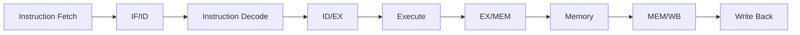

```markdown
# RISC-V RV32I 5-Stage Pipelined Processor

<div align="center">


**A modular 32-bit RV32I pipelined processor designed in Verilog HDL featuring hazard detection, data forwarding, branch handling, and cycle-accurate simulation.**

</div>

---

# Table of Contents

- [Overview](#overview)
- [Project Objectives](#project-objectives)
- [Features](#features)
- [Processor Architecture](#processor-architecture)
- [Pipeline Stages](#pipeline-stages)
- [Pipeline Diagram](#pipeline-diagram)
- [Processor Datapath](#processor-datapath)
- [Directory Structure](#directory-structure)

---

# Overview

This project implements a **32-bit RISC-V RV32I processor** using a **five-stage pipelined architecture** in **Verilog HDL**. The processor was developed to explore modern processor design principles including pipelining, hazard resolution, instruction decoding, memory interfacing, and RTL verification.

Unlike a basic single-cycle implementation, this processor overlaps instruction execution across multiple pipeline stages to improve throughput while maintaining correct program execution. To support pipelined execution, the design incorporates **data forwarding**, **load-use hazard detection**, **pipeline stalling**, and **branch flushing** mechanisms.

The processor has been verified through individual module-level testbenches as well as full CPU integration testing using **Icarus Verilog** and **GTKWave**, ensuring correct functionality across arithmetic, logical, memory, and branch operations.

The entire design follows a modular RTL methodology where each functional block is implemented as an independent Verilog module, simplifying debugging, verification, and future architectural enhancements.

---

# Project Objectives

The primary goals of this project were:

- Design a complete 32-bit RV32I processor in Verilog HDL.
- Implement a classic five-stage RISC pipeline.
- Develop reusable RTL modules with clear interfaces.
- Understand datapath and control path interactions.
- Resolve data and control hazards in a pipelined processor.
- Verify functionality through simulation and waveform analysis.
- Follow engineering practices similar to those used in RTL design and hardware verification workflows.

---

# Features

## Processor

- 32-bit RISC-V RV32I processor
- Five-stage pipelined architecture
- Modular RTL implementation
- Harvard-style instruction and data memories
- Parameterized ALU control logic

## Instruction Support

- R-Type Arithmetic Instructions
- I-Type Immediate Instructions
- Load Instructions
- Store Instructions
- Branch Instructions
- Jump Instructions
- Upper Immediate Instructions

## Pipeline Components

- Program Counter (PC)
- Instruction Memory
- IF/ID Pipeline Register
- Register File
- Immediate Generator
- Control Unit
- ID/EX Pipeline Register
- Arithmetic Logic Unit (ALU)
- EX/MEM Pipeline Register
- Data Memory
- MEM/WB Pipeline Register
- Write Back Multiplexer

## Hazard Handling

- Data Forwarding Unit
- Load-Use Hazard Detection
- Pipeline Stall Generation
- Bubble (NOP) Insertion
- Branch Flush Logic

## Verification

- Individual module verification
- CPU integration testing
- Waveform-based debugging
- Custom Verilog testbenches
- Cycle-by-cycle pipeline verification

---

# Processor Architecture

The processor follows the classic **five-stage RISC pipeline**, allowing multiple instructions to execute concurrently in different stages of the datapath.

```

Instruction Fetch
│
▼
Instruction Decode
│
▼
Execute
│
▼
Memory Access
│
▼
Write Back

````

Each stage performs a dedicated task and passes intermediate results to the next stage using pipeline registers.

The processor implements dedicated hazard handling hardware to ensure correct execution when instructions have data or control dependencies.

---

# Pipeline Stages

## 1. Instruction Fetch (IF)

The Instruction Fetch stage retrieves the next instruction from instruction memory using the current Program Counter (PC).

### Responsibilities

- Read instruction memory
- Generate sequential PC (PC + 4)
- Select branch or jump target
- Pass instruction to IF/ID register

### Main Components

- Program Counter
- PC Adder
- Instruction Memory
- IF/ID Pipeline Register

---

## 2. Instruction Decode (ID)

The Decode stage interprets the fetched instruction and prepares all information required for execution.

### Responsibilities

- Decode opcode
- Generate control signals
- Read source registers
- Generate immediate values
- Detect hazards
- Stall pipeline if required

### Main Components

- Register File
- Immediate Generator
- Control Unit
- Hazard Detection Unit
- ID/EX Pipeline Register

---

## 3. Execute (EX)

The Execute stage performs arithmetic and logical operations and computes branch decisions.

### Responsibilities

- Execute ALU operations
- Compute memory addresses
- Compare branch operands
- Resolve branch conditions
- Perform operand forwarding

### Main Components

- ALU
- Forwarding Unit
- Operand Multiplexers
- Branch Logic
- EX/MEM Pipeline Register

---

## 4. Memory Access (MEM)

The Memory stage accesses data memory for load and store instructions.

### Responsibilities

- Read memory
- Write memory
- Pass ALU results forward
- Forward loaded data

### Main Components

- Data Memory
- EX/MEM Register
- MEM/WB Register

---

## 5. Write Back (WB)

The final pipeline stage writes computation or memory results back into the destination register.

### Responsibilities

- Select ALU result or memory data
- Write destination register
- Complete instruction execution

### Main Components

- Write Back Multiplexer
- Register File Write Port

---

# Pipeline Diagram

```mermaid
flowchart LR

IF["Instruction Fetch (IF)"]
IFID["IF/ID"]

ID["Instruction Decode (ID)"]
IDEX["ID/EX"]

EX["Execute (EX)"]
EXMEM["EX/MEM"]

MEM["Memory (MEM)"]
MEMWB["MEM/WB"]

WB["Write Back (WB)"]

IF --> IFID
IFID --> ID
ID --> IDEX
IDEX --> EX
EX --> EXMEM
EXMEM --> MEM
MEM --> MEMWB
MEMWB --> WB
````

---

# Processor Datapath

The processor datapath is composed of several interconnected RTL modules responsible for instruction execution.

```
              +----------------------+
              |    Program Counter   |
              +----------+-----------+
                         |
                         v
              +----------------------+
              | Instruction Memory   |
              +----------+-----------+
                         |
                    IF/ID Register
                         |
                         v
              +----------------------+
              |    Register File     |
              +----------+-----------+
                         |
              +----------+-----------+
              |                      |
              v                      v
      Immediate Generator      Control Unit
              |                      |
              +----------+-----------+
                         |
                    ID/EX Register
                         |
                         v
              +----------------------+
              |        ALU           |
              +----------+-----------+
                         |
                    EX/MEM Register
                         |
                         v
              +----------------------+
              |    Data Memory       |
              +----------+-----------+
                         |
                    MEM/WB Register
                         |
                         v
              +----------------------+
              |     Write Back       |
              +----------+-----------+
                         |
                         v
                  Register File
```

The datapath follows a conventional pipelined organization while incorporating forwarding paths and hazard detection logic to maintain correctness during concurrent instruction execution.

---

## Datapath Components

| Component              | Purpose                                                              |
| ---------------------- | -------------------------------------------------------------------- |
| Program Counter        | Stores the address of the next instruction                           |
| Instruction Memory     | Supplies instructions to the pipeline                                |
| Register File          | Stores thirty-two 32-bit general-purpose registers                   |
| Immediate Generator    | Generates sign-extended immediates for supported instruction formats |
| Control Unit           | Produces datapath and memory control signals                         |
| ALU                    | Performs arithmetic, logical, comparison, and shift operations       |
| Forwarding Unit        | Resolves RAW hazards without stalling whenever possible              |
| Hazard Detection Unit  | Detects load-use hazards and inserts pipeline bubbles                |
| Data Memory            | Performs load and store operations                                   |
| Pipeline Registers     | Preserve instruction state between pipeline stages                   |
| Write Back Multiplexer | Selects memory data or ALU result for register write-back            |

---

# Directory Structure

```text
RISCV_CPU/
│
├── rtl/
│   ├── alu.v
│   ├── control_unit.v
│   ├── cpu_pipeline.v
│   ├── data_memory.v
│   ├── ex_mem.v
│   ├── forwarding_unit.v
│   ├── hazard_detection_unit.v
│   ├── id_ex.v
│   ├── if_id.v
│   ├── imm_gen.v
│   ├── instruction_memory.v
│   ├── mem_wb.v
│   ├── pc.v
│   └── regfile.v
│
├── tb/
│   ├── cpu_tb.v
│   ├── alu_tb.v
│   ├── regfile_tb.v
│   ├── imm_gen_tb.v
│   ├── control_unit_tb.v
│   └── ...
│
├── tests/
│   └── memory_test.mem
│
├── waveforms/
│   └── *.vcd
│
├── docs/
│   └── (architecture diagrams and screenshots)
│
└── README.md
```

---

## Folder Description

| Folder       | Description                                                                                                              |
| ------------ | ------------------------------------------------------------------------------------------------------------------------ |
| `rtl/`       | Contains all synthesizable Verilog RTL modules implementing the processor datapath and control logic.                    |
| `tb/`        | Module-level and processor-level testbenches used for functional verification.                                           |
| `tests/`     | Memory initialization files containing assembled RISC-V programs loaded into instruction memory during simulation.       |
| `waveforms/` | Generated VCD waveform files used for debugging and timing analysis in GTKWave.                                          |
| `docs/`      | Documentation assets such as architecture diagrams, datapath figures, screenshots, and additional project illustrations. |

---

**Next Section:** *Implemented Instructions, Hazard Handling, Branch Handling, Pipeline Registers, and detailed RTL module documentation.*

```
```
````markdown
---

# Implemented Instructions

The processor currently implements a subset of the **RV32I Base Integer Instruction Set Architecture (ISA)**. The supported instructions cover arithmetic, logical, immediate, memory, branch, jump, and upper-immediate operations required for a functional pipelined processor.

| Instruction | Type | Status | Description |
|------------|------|--------|-------------|
| ADD | R-Type | ✅ | Adds two registers |
| SUB | R-Type | ✅ | Subtracts two registers |
| AND | R-Type | ✅ | Bitwise AND |
| OR | R-Type | ✅ | Bitwise OR |
| XOR | R-Type | ✅ | Bitwise XOR |
| SLT | R-Type | ✅ | Set if Less Than (signed comparison) |
| SLL | R-Type | ✅ | Logical Left Shift |
| SRL | R-Type | ✅ | Logical Right Shift |
| SRA | R-Type | ✅ | Arithmetic Right Shift |
| ADDI | I-Type | ✅ | Add Immediate |
| ANDI | I-Type | ✅ | Bitwise AND Immediate |
| ORI | I-Type | ✅ | Bitwise OR Immediate |
| XORI | I-Type | ✅ | Bitwise XOR Immediate |
| SLLI | I-Type | ✅ | Logical Left Shift Immediate |
| SRLI | I-Type | ✅ | Logical Right Shift Immediate |
| SRAI | I-Type | ✅ | Arithmetic Right Shift Immediate |
| LW | I-Type | ✅ | Load Word from Data Memory |
| SW | S-Type | ✅ | Store Word to Data Memory |
| BEQ | B-Type | ✅ | Branch if Equal |
| BNE | B-Type | ✅ | Branch if Not Equal |
| JAL | J-Type | ✅ | Jump and Link |
| LUI | U-Type | ✅ | Load Upper Immediate |
| AUIPC | U-Type | ✅ | Add Upper Immediate to PC |

---

# Supported Instruction Formats

The Immediate Generator currently supports all instruction formats required by the implemented ISA subset.

| Format | Supported |
|---------|-----------|
| R-Type | ✅ |
| I-Type | ✅ |
| S-Type | ✅ |
| B-Type | ✅ |
| U-Type | ✅ |
| J-Type | ✅ |

---

# Hazard Handling

Pipelining significantly improves processor throughput but introduces situations where instructions become dependent on one another. This processor incorporates dedicated hardware to resolve these hazards while maintaining correct program execution.

The current implementation supports:

- Data Forwarding
- Load-Use Hazard Detection
- Pipeline Stall Generation
- Bubble (NOP) Insertion
- Branch Flush

---

# Data Hazards

A **Read After Write (RAW)** dependency occurs when an instruction requires a value that has not yet reached the Write Back stage.

Example:

```assembly
addi x1, x0, 10
addi x2, x0, 20
add  x3, x1, x2
```

Without forwarding, the third instruction would read stale register values because the first two instructions have not yet completed Write Back.

To eliminate unnecessary stalls, the processor implements a forwarding network.

---

## Forwarding Unit

The forwarding unit continuously compares the destination registers of instructions in later pipeline stages with the source registers of the instruction currently in the Execute stage.

Forwarding sources include:

- EX/MEM pipeline register
- MEM/WB pipeline register

Destination:

- ALU Operand A
- ALU Operand B

### Forwarding Paths

```text
                EX/MEM
                   │
         ┌─────────┴─────────┐
         │                   │
         ▼                   ▼
     ALU Input A        ALU Input B


                MEM/WB
                   │
         ┌─────────┴─────────┐
         │                   │
         ▼                   ▼
     ALU Input A        ALU Input B
```

Forwarding is prioritized from the EX/MEM stage to ensure the most recently computed value is always selected.

---

## Forwarding Logic

The forwarding unit generates two control signals:

| Signal | Function |
|---------|----------|
| `forward_a` | Selects source for ALU operand A |
| `forward_b` | Selects source for ALU operand B |

Encoding:

| Value | Source |
|-------|--------|
| 00 | Register File |
| 01 | MEM/WB |
| 10 | EX/MEM |

---

## Load-Use Hazard

Forwarding alone cannot resolve every dependency.

Consider:

```assembly
lw   x1,0(x0)
add  x2,x1,x3
```

The loaded value is produced only during the Memory stage.

The following instruction requires that value one cycle earlier.

Forwarding cannot provide data that has not yet been read from memory.

---

## Hazard Detection Unit

The processor includes a dedicated Hazard Detection Unit that detects load-use hazards during the Decode stage.

The unit compares:

- destination register of the instruction in ID/EX
- source registers of the instruction in IF/ID

If a dependency is detected:

- PC update is disabled
- IF/ID register is frozen
- ID/EX control signals are cleared
- A pipeline bubble is inserted

This prevents the dependent instruction from entering the Execute stage until the required data becomes available.

---

## Pipeline Stall

When a load-use dependency is detected:

```text
Cycle

LW
IF -> ID -> EX -> MEM -> WB

ADD
     IF -> ID -> Stall -> EX -> MEM -> WB
```

Only a single bubble is inserted.

Normal pipeline execution resumes automatically after the required value becomes available.

---

## Bubble (NOP) Insertion

Instead of stopping the entire processor, the Hazard Detection Unit inserts a NOP into the Execute stage.

This is achieved by clearing the control signals entering the ID/EX pipeline register.

As a result:

- No register is written.
- No memory operation occurs.
- No architectural state changes.

The bubble simply occupies one pipeline cycle before normal execution resumes.

---

# Control Hazards

Control hazards occur whenever the processor encounters branch or jump instructions.

Until the branch decision is resolved, the processor continues fetching sequential instructions.

If the branch is taken, these instructions become invalid.

---

# Branch Handling

The processor currently supports:

| Instruction | Function |
|------------|----------|
| BEQ | Branch if Equal |
| BNE | Branch if Not Equal |
| JAL | Jump and Link |

Branch comparisons are performed in the Execute stage using the ALU.

The ALU subtracts both operands and uses the Zero flag to determine branch outcomes.

```text
BEQ

rs1 == rs2
        │
        ▼
 ALU Subtraction
        │
        ▼
Zero = 1
        │
        ▼
Branch Taken
```

Similarly,

```text
BNE

rs1 != rs2
        │
        ▼
Zero = 0
        │
        ▼
Branch Taken
```

---

## Branch Decision

The processor computes:

```
Branch Target Address

PC + Immediate
```

If the branch condition evaluates to true,

the Program Counter is updated with the computed branch target.

Otherwise,

execution continues with:

```
PC + 4
```

---

# Branch Flush

By the time a branch decision is known, one or more instructions have already entered the pipeline.

If the branch is taken, these instructions correspond to the wrong execution path.

To prevent incorrect execution, the processor performs a pipeline flush.

---

## Flush Mechanism

When a branch is taken:

- IF/ID pipeline register is flushed.
- Instruction field is replaced with a NOP (`addi x0, x0, 0`).
- ID/EX control signals are cleared.
- Program Counter is redirected to the branch target.

This removes all incorrectly fetched instructions before they reach execution.

---

## Why Flushing is Necessary

Example:

```assembly
beq x1,x2,label
add x5,x6,x7
sub x8,x9,x10

label:
or x3,x4,x5
```

Without flushing,

```
ADD
SUB
```

would still execute even though the branch has already changed the control flow.

Flushing guarantees that only instructions belonging to the correct execution path are allowed to proceed.

---

# Jump Handling

The processor also supports the `JAL` instruction.

For a jump,

the processor computes:

```
PC + Immediate
```

and immediately redirects instruction fetch to the target address.

The destination register receives the return address during the Write Back stage.

---

# Pipeline Registers

Pipeline registers isolate the five execution stages and preserve intermediate values between clock cycles.

Each register stores both data and associated control signals.

---

## IF/ID Register

Purpose:

Stores information fetched during the Instruction Fetch stage.

Stored Information:

- Current PC
- Current Instruction

Additional Features:

- Pipeline Stall Support
- Branch Flush Support
- NOP Injection

---

## ID/EX Register

Purpose:

Transfers decoded information into the Execute stage.

Stored Signals include:

- Program Counter
- Register Operand 1
- Register Operand 2
- Immediate Value
- Source Register Addresses
- Destination Register
- ALU Control
- Branch Control
- Memory Control
- Register Write Control

Additional Feature:

Bubble insertion by clearing control signals during load-use hazards.

---

## EX/MEM Register

Purpose:

Transfers execution results into the Memory stage.

Stored Information:

- ALU Result
- Store Data
- Destination Register
- Register Write Enable
- Memory Read Enable
- Memory Write Enable
- Mem-to-Reg Control

---

## MEM/WB Register

Purpose:

Transfers final execution results into the Write Back stage.

Stored Information:

- Memory Read Data
- ALU Result
- Destination Register
- Register Write Enable
- Mem-to-Reg Selection

---

# Pipeline Data Flow



---

# Control Signal Flow

The Control Unit generates all control signals during the Decode stage.

These signals are propagated through the pipeline registers until they reach the stage where they are required.

```
Instruction
      │
      ▼
Control Unit
      │
      ▼
ID/EX Register
      │
      ▼
EX/MEM Register
      │
      ▼
MEM/WB Register
```

This ensures that each instruction carries its own control information as it progresses through the pipeline, allowing multiple instructions to execute concurrently without interfering with one another.

---

**Next Section:** Detailed RTL Module Documentation (`pc.v`, `instruction_memory.v`, `control_unit.v`, `regfile.v`, `imm_gen.v`, `alu.v`, `forwarding_unit.v`, `hazard_detection_unit.v`, all pipeline registers, `data_memory.v`, and `cpu_pipeline.v`).
````
````markdown
---

# RTL Module Description

The processor is implemented using a modular RTL design methodology where each hardware block is encapsulated in an independent Verilog module. This approach improves readability, verification, maintainability, and future scalability while closely following industry RTL design practices.

Each module has a clearly defined responsibility and communicates with the rest of the processor through well-defined interfaces.

---

# Module Overview

| Module | Purpose |
|---------|----------|
| `pc.v` | Program Counter |
| `instruction_memory.v` | Instruction Memory |
| `if_id.v` | IF/ID Pipeline Register |
| `regfile.v` | Register File |
| `imm_gen.v` | Immediate Generator |
| `control_unit.v` | Instruction Decoder and Control Signal Generator |
| `hazard_detection_unit.v` | Load-Use Hazard Detection |
| `id_ex.v` | ID/EX Pipeline Register |
| `forwarding_unit.v` | Data Forwarding Logic |
| `alu.v` | Arithmetic Logic Unit |
| `ex_mem.v` | EX/MEM Pipeline Register |
| `data_memory.v` | Data Memory |
| `mem_wb.v` | MEM/WB Pipeline Register |
| `cpu_pipeline.v` | Top-Level Processor Integration |

---

# Program Counter (`pc.v`)

## Purpose

The Program Counter (PC) stores the address of the instruction currently being fetched.

It is responsible for advancing sequential execution, handling pipeline stalls, and updating the instruction address during branch and jump operations.

---

## Inputs

| Signal | Width | Description |
|---------|------|-------------|
| `clk` | 1 | System clock |
| `reset` | 1 | Active-high reset |
| `pc_write` | 1 | Enables or stalls PC update |
| `next_pc` | 32 | Next instruction address |

---

## Outputs

| Signal | Width | Description |
|---------|------|-------------|
| `pc` | 32 | Current Program Counter value |

---

## Functionality

On every positive clock edge:

- PC resets to zero when reset is asserted.
- If `pc_write` is enabled, the PC is updated with `next_pc`.
- During a pipeline stall, the PC retains its current value.

This mechanism is used by the Hazard Detection Unit to freeze instruction fetch during load-use hazards.

---

# Instruction Memory (`instruction_memory.v`)

## Purpose

Stores the instruction program executed by the processor.

Instructions are loaded from an external hexadecimal memory file during simulation using:

```verilog
$readmemh("tests/memory_test.mem", memory);
```

---

## Inputs

| Signal | Width | Description |
|---------|------|-------------|
| `address` | 32 | Instruction address from Program Counter |

---

## Outputs

| Signal | Width | Description |
|---------|------|-------------|
| `instruction` | 32 | Fetched instruction |

---

## Functionality

The instruction memory is organized as a 256-word array.

The Program Counter is word-aligned, therefore:

```
memory[address[9:2]]
```

is used for instruction access.

Instruction memory is read combinationally.

---

# IF/ID Pipeline Register (`if_id.v`)

## Purpose

Separates the Fetch and Decode stages.

It stores the fetched instruction together with the Program Counter.

---

## Stored Information

- Current PC
- Current Instruction

---

## Additional Features

### Pipeline Stall

When `ifid_write` is deasserted,

the register retains its previous contents.

This effectively freezes the Decode stage.

---

### Branch Flush

When `flush` is asserted,

the instruction register is replaced with

```assembly
addi x0,x0,0
```

which acts as a NOP.

This removes incorrectly fetched instructions after a taken branch.

---

# Register File (`regfile.v`)

## Purpose

Stores the processor's general-purpose registers.

The implementation follows the RV32I architectural register model.

---

## Features

- 32 general-purpose registers
- 32-bit register width
- Register x0 permanently reads as zero
- Synchronous write
- Asynchronous read
- Reset clears all registers

---

## Inputs

| Signal | Description |
|---------|-------------|
| `rs1_addr` | Source Register 1 |
| `rs2_addr` | Source Register 2 |
| `rd_addr` | Destination Register |
| `rd_data` | Data to be written |
| `reg_write` | Register Write Enable |
| `clk` | Clock |
| `reset` | Reset |

---

## Outputs

| Signal | Description |
|---------|-------------|
| `rs1_data` | Source Operand 1 |
| `rs2_data` | Source Operand 2 |

---

## Design Notes

Register x0 is protected from modification.

```verilog
(rd_addr != 5'b00000)
```

ensures writes to x0 are ignored.

Operands are continuously available through asynchronous read ports.

---

# Immediate Generator (`imm_gen.v`)

## Purpose

Generates sign-extended immediate values for supported instruction formats.

---

## Supported Formats

| Format | Supported |
|---------|-----------|
| I-Type | ✅ |
| S-Type | ✅ |
| B-Type | ✅ |
| U-Type | ✅ |
| J-Type | ✅ |

---

## Functionality

The Immediate Generator extracts immediate fields based on the instruction opcode and performs sign extension to produce a 32-bit immediate value.

This module centralizes immediate decoding and simplifies datapath design.

---

# Control Unit (`control_unit.v`)

## Purpose

The Control Unit decodes each fetched instruction and generates all control signals required throughout the processor pipeline.

---

## Generated Control Signals

| Signal | Description |
|---------|-------------|
| `reg_write` | Register File Write Enable |
| `alu_src` | ALU Operand Selection |
| `mem_read` | Memory Read Enable |
| `mem_write` | Memory Write Enable |
| `branch` | BEQ Control |
| `branch_ne` | BNE Control |
| `jal` | Jump Control |
| `lui` | Load Upper Immediate |
| `auipc` | AUIPC Control |
| `alu_control` | ALU Operation Select |

---

## Supported Instruction Categories

- R-Type
- I-Type
- Load
- Store
- Branch
- Jump
- Upper Immediate

---

## ALU Control Encoding

| Operation | Encoding |
|-----------|----------|
| ADD | 0000 |
| SUB | 0001 |
| OR | 0010 |
| AND | 0011 |
| XOR | 0100 |
| SLT | 0101 |
| SLL | 0110 |
| SRL | 0111 |
| SRA | 1000 |

---

# Hazard Detection Unit (`hazard_detection_unit.v`)

## Purpose

Detects pipeline hazards that cannot be resolved using forwarding.

---

## Current Hazard Detection

The unit detects

- Load-Use Hazards

by comparing

```
ID/EX Destination Register
```

against

```
IF/ID Source Registers
```

---

## Generated Outputs

| Signal | Function |
|---------|----------|
| `pc_write` | Freeze Program Counter |
| `ifid_write` | Freeze IF/ID Register |
| `control_mux` | Insert Bubble |

---

## Functionality

If a dependency is detected,

the Hazard Detection Unit:

- Stops PC updates
- Prevents IF/ID register updates
- Clears control signals entering ID/EX
- Inserts one NOP

Execution resumes automatically on the following cycle.

---

# ID/EX Pipeline Register (`id_ex.v`)

## Purpose

Transfers decoded operands and control signals into the Execute stage.

---

## Stored Data

- Program Counter
- Source Register Data
- Immediate Value
- Source Register Addresses
- Destination Register
- ALU Control

---

## Stored Control Signals

- Register Write
- Memory Read
- Memory Write
- Mem-to-Reg
- ALU Source
- Branch
- Branch Not Equal
- Jump

---

## Bubble Support

When

```
control_mux = 1
```

the register clears its control signals while preserving datapath values.

This effectively inserts a NOP into the pipeline.

---

# Forwarding Unit (`forwarding_unit.v`)

## Purpose

Resolves Read After Write (RAW) hazards without stalling the pipeline whenever possible.

---

## Inputs

- Source registers from ID/EX
- Destination register from EX/MEM
- Destination register from MEM/WB
- Register write enables

---

## Outputs

| Signal | Description |
|---------|-------------|
| `forward_a` | ALU Operand A Selection |
| `forward_b` | ALU Operand B Selection |

---

## Forwarding Priority

Highest Priority

```
EX/MEM
```

Second Priority

```
MEM/WB
```

Lowest Priority

```
Register File
```

This guarantees the newest available value is always selected.

---

# Arithmetic Logic Unit (`alu.v`)

## Purpose

Performs arithmetic, logical, comparison, and shift operations.

---

## Supported Operations

| Operation | Description |
|-----------|-------------|
| ADD | Addition |
| SUB | Subtraction |
| AND | Bitwise AND |
| OR | Bitwise OR |
| XOR | Bitwise XOR |
| SLT | Signed Less Than |
| SLL | Logical Left Shift |
| SRL | Logical Right Shift |
| SRA | Arithmetic Right Shift |

---

## Outputs

| Signal | Description |
|---------|-------------|
| `result` | ALU Result |
| `zero` | Asserted when result equals zero |

---

## Branch Support

The Zero flag is used by the branch logic to evaluate

- BEQ
- BNE

allowing branch decisions to be made during the Execute stage.

---

# EX/MEM Pipeline Register (`ex_mem.v`)

## Purpose

Stores execution results before entering the Memory stage.

---

## Stored Information

- ALU Result
- Store Data
- Destination Register
- Register Write Enable
- Memory Read Enable
- Memory Write Enable
- Mem-to-Reg Control

---

## Functionality

The register isolates the Execute and Memory stages, allowing simultaneous execution of multiple instructions.

---

# Data Memory (`data_memory.v`)

## Purpose

Implements the processor's data memory subsystem.

---

## Features

- 256 words
- 32-bit width
- Word aligned
- Synchronous writes
- Combinational reads

---

## Memory Access

Word addressing is performed using

```
address[9:2]
```

which ignores byte offsets.

---

## Supported Operations

| Operation | Description |
|-----------|-------------|
| LW | Load Word |
| SW | Store Word |

---

# MEM/WB Pipeline Register (`mem_wb.v`)

## Purpose

Transfers the final execution results into the Write Back stage.

---

## Stored Information

- Memory Data
- ALU Result
- Destination Register
- Register Write Enable
- Mem-to-Reg Control

---

## Functionality

This register preserves execution results until the Register File performs the final write-back operation.

---

# Top-Level Processor (`cpu_pipeline.v`)

## Purpose

The `cpu_pipeline` module integrates every RTL block into a complete five-stage pipelined processor.

It represents the highest level of the processor hierarchy.

---

## Major Responsibilities

- Program Counter update
- Next-PC selection
- Branch target computation
- Instruction Fetch
- Instruction Decode
- Register File access
- Immediate generation
- ALU operand selection
- Forwarding control
- Hazard detection
- Branch decision
- Data Memory access
- Write Back selection

---

## Branch Logic

The processor determines branch outcomes using:

```verilog
branch_taken =
(idex_branch && zero) ||
(idex_branch_ne && !zero);
```

The next Program Counter is then selected between:

- Sequential execution (`PC + 4`)
- Branch target
- Jump target (`JAL`)

---

## Data Flow Summary

```text
Program Counter
        │
        ▼
Instruction Memory
        │
        ▼
IF/ID Register
        │
        ▼
Register File
        │
        ▼
Immediate Generator
        │
        ▼
Control Unit
        │
        ▼
ID/EX Register
        │
        ▼
Forwarding Unit
        │
        ▼
ALU
        │
        ▼
EX/MEM Register
        │
        ▼
Data Memory
        │
        ▼
MEM/WB Register
        │
        ▼
Write Back
        │
        ▼
Register File
```

---

# Design Philosophy

The processor was designed with a strong emphasis on modularity and verification.

Each architectural block was first developed and verified independently before integration into the complete processor. This incremental development methodology simplified debugging and enabled isolated verification of individual components before introducing pipeline interactions.

The final implementation combines these verified modules into a cohesive five-stage pipeline capable of handling arithmetic, logical, memory, branch, and jump instructions while resolving common pipeline hazards through forwarding, stalling, and branch flushing.

---

**Next Section:** Simulation, Testing Methodology, Example Outputs, Debugging Case Studies, Challenges Faced, Known Limitations, Future Improvements, Skills Demonstrated, and How to Run.
````
````markdown
---

# Simulation

Functional verification of the processor was performed entirely through simulation before hardware implementation. Every RTL module was individually tested using dedicated Verilog testbenches, followed by full-system integration testing of the pipelined processor.

The simulation workflow uses **Icarus Verilog** for compilation and execution and **GTKWave** for waveform inspection and debugging.

---

## Verification Flow

```text
Individual RTL Module
          │
          ▼
Functional Testbench
          │
          ▼
Waveform Verification
          │
          ▼
CPU Integration
          │
          ▼
Pipeline Verification
          │
          ▼
Hazard Verification
          │
          ▼
Regression Testing
```

---

## Simulation Tools

| Tool | Purpose |
|-------|---------|
| Icarus Verilog | RTL Compilation and Simulation |
| GTKWave | Waveform Analysis |
| VS Code | Development Environment |
| Git | Version Control |

---

## Compiling the Design

Compile all RTL files together with the processor testbench.

```bash
iverilog -o cpu_pipeline_sim rtl/*.v tb/cpu_tb.v
```

If individual modules need to be tested, compile the corresponding testbench.

Example:

```bash
iverilog -o alu_sim rtl/alu.v tb/alu_tb.v
```

---

## Running the Simulation

```bash
vvp cpu_pipeline_sim
```

Simulation prints register values, instruction execution information, and internal debug signals to the terminal.

---

## Viewing Waveforms

Waveforms are generated in VCD format.

Open them using GTKWave.

```bash
gtkwave cpu.vcd
```

Waveform inspection was extensively used throughout development to verify:

- Program Counter updates
- Pipeline register contents
- ALU inputs and outputs
- Forwarding signals
- Hazard detection signals
- Memory transactions
- Register write-back
- Branch flushing
- Pipeline stalls

---

# Example Simulation Output

A simple arithmetic program was used during processor verification.

### Test Program

```assembly
addi x1, x0, 10
addi x2, x0, 20
add  x3, x1, x2
```

Expected Register Values

```
x1 = 10
x2 = 20
x3 = 30
```

Simulation Output

```text
x1 = 10
x2 = 20
x3 = 30
```

This verifies that:

- Immediate generation is correct.
- Register writes occur correctly.
- ALU performs addition correctly.
- Data forwarding resolves RAW hazards.
- Pipeline stages operate correctly.

---

# Pipeline Debug Output

During processor debugging, several internal signals were monitored every clock cycle.

Example:

```text
Time = 65

PC                = 0x00000010
Instruction       = add x4, x3, x1

forward_a         = 10
forward_b         = 00

idex_rs1_data     = 15
idex_rs2_data     = 5

alu_in1           = 15
alu_b             = 5

alu_result        = 20
```

These debug signals made it possible to verify forwarding decisions, ALU inputs, and pipeline timing on a cycle-by-cycle basis.

---

# Testing Methodology

The processor was developed incrementally.

Rather than integrating every module immediately, each RTL block was individually verified before becoming part of the complete processor.

This significantly simplified debugging and reduced integration errors.

---

## Module-Level Verification

Each hardware block was tested independently.

Modules verified include:

- Program Counter
- Register File
- ALU
- Immediate Generator
- Control Unit
- Instruction Memory
- Data Memory
- Forwarding Unit
- Hazard Detection Unit
- Pipeline Registers

Each module includes dedicated Verilog testbenches covering normal operation, edge cases, and reset behavior.

---

## Processor-Level Verification

After verifying individual modules, the complete processor was assembled and tested using complete instruction sequences.

Programs were executed directly from Instruction Memory to validate interaction between all pipeline stages.

Processor-level verification included:

- Arithmetic instructions
- Immediate instructions
- Memory operations
- Branch instructions
- Jump instructions
- Hazard handling
- Pipeline flushing
- Register write-back
- Data forwarding

---

## Waveform Verification

Every major architectural feature was verified using GTKWave.

Signals inspected include:

### Fetch Stage

- Program Counter
- Instruction Memory Output

### Decode Stage

- Register File Outputs
- Immediate Generator Output
- Control Signals

### Execute Stage

- ALU Inputs
- ALU Result
- Forwarding Control
- Branch Decision

### Memory Stage

- Memory Address
- Memory Read Data
- Memory Write Data

### Write Back Stage

- Register Write Enable
- Destination Register
- Write Back Data

---

# Verification Coverage

The following processor features have been verified through simulation.

| Feature | Verification Status |
|----------|---------------------|
| Program Counter | ✅ |
| Register File | ✅ |
| ALU Operations | ✅ |
| Immediate Generator | ✅ |
| Instruction Decode | ✅ |
| Control Signal Generation | ✅ |
| Instruction Fetch | ✅ |
| Data Memory | ✅ |
| Pipeline Registers | ✅ |
| Forwarding Unit | ✅ |
| Hazard Detection | ✅ |
| Pipeline Stall | ✅ |
| Branch Flush | ✅ |
| Branch Instructions | ✅ |
| Jump Instructions | ✅ |
| Complete Processor Integration | ✅ |

---

# Engineering Challenges

Designing a pipelined processor introduces significantly greater complexity than a single-cycle implementation.

Several architectural challenges were encountered during development and resolved through incremental debugging and waveform analysis.

---

## Pipeline Synchronization

### Challenge

Multiple instructions execute simultaneously across different pipeline stages.

Incorrect synchronization between pipeline registers can result in stale operands or incorrect control signals propagating through the datapath.

### Solution

Dedicated pipeline registers were introduced between every stage to preserve instruction state and associated control information throughout execution.

---

## Forwarding Logic

### Challenge

Dependent arithmetic instructions initially produced incorrect results due to Read After Write (RAW) hazards.

### Solution

A forwarding network was implemented to bypass values directly from:

- EX/MEM
- MEM/WB

to the ALU inputs.

This eliminated unnecessary pipeline stalls for most arithmetic dependencies.

---

## Register File Timing

### Challenge

While verifying forwarding, dependent instructions occasionally received outdated register values even though the forwarding logic was operating correctly.

Cycle-by-cycle waveform analysis revealed that the issue originated from register file timing rather than forwarding itself.

### Root Cause

The Register File write-back and Decode stage operand capture occurred during the same clock edge.

As a result, recently written values were not visible to instructions decoding in that cycle.

### Solution

The register write timing was adjusted to eliminate the read-after-write timing conflict, ensuring updated values were available before operand capture.

This resolved the dependency issue while preserving forwarding functionality.

---

## Load-Use Hazards

### Challenge

Forwarding alone cannot resolve hazards involving load instructions because memory data becomes available only after the Memory stage.

Example:

```assembly
lw  x1,0(x0)
add x2,x1,x3
```

### Solution

A dedicated Hazard Detection Unit was implemented.

The unit:

- Detects load-use dependencies
- Freezes the Program Counter
- Freezes the IF/ID register
- Inserts a bubble into the Execute stage

Only a single pipeline cycle is lost before execution resumes.

---

## Branch Hazards

### Challenge

Sequential instructions continue entering the pipeline before the branch decision is resolved.

Without corrective action, instructions from the wrong execution path would still execute.

### Solution

Branch flushing was implemented.

When a branch is taken:

- The Program Counter is redirected.
- IF/ID is flushed.
- A NOP is injected.
- Incorrectly fetched instructions are discarded.

This guarantees correct control flow.

---

## Debugging Strategy

Debugging pipeline processors is substantially more challenging than debugging combinational modules.

Instead of observing only outputs, the following internal signals were monitored throughout development:

- Pipeline register contents
- Program Counter
- ALU operands
- Forwarding signals
- Hazard detection signals
- Branch decisions
- Register file outputs
- Write-back data

Waveform analysis combined with cycle-by-cycle terminal debugging proved essential for identifying pipeline timing issues.

---

# Known Limitations

Although the processor implements a functional five-stage pipelined RV32I architecture, several advanced architectural features remain outside the scope of the current implementation.

These are considered future enhancements rather than design defects.

| Feature | Status | Remarks |
|----------|--------|---------|
| Store Data Forwarding | ❌ | Store instructions cannot forward recently computed values to the memory write port. |
| Cache Memory | ❌ | Uses simple instruction and data memories. |
| Branch Prediction | ❌ | Branches are resolved in the Execute stage with pipeline flushing. |
| CSR Instructions | ❌ | Control and Status Registers are not implemented. |
| Interrupt Handling | ❌ | Interrupt support not included. |
| Exception Handling | ❌ | Processor does not currently support exceptions. |
| Multiply/Divide Instructions | ❌ | RV32M extension not implemented. |
| Byte/Halfword Memory Access | ❌ | Only word-aligned load/store operations are supported. |

---

## Store Data Forwarding

The forwarding network currently supplies operands only to the ALU.

Store instructions receive write data directly from the pipeline register.

Consequently, a recently computed register value cannot be forwarded directly into a Store instruction.

In such cases, inserting NOPs between the producing instruction and the Store instruction ensures correct execution.

Extending the forwarding network to the Data Memory write port would remove this limitation.

---

# Future Improvements

Several architectural extensions can be added without significantly modifying the existing modular design.

## Processor Features

- Store Data Forwarding
- Branch Prediction
- Dynamic Branch Target Buffer
- Pipeline Performance Optimization
- Full RV32I Instruction Coverage
- RV32M Extension (Multiply/Divide)

---

## Memory System

- Instruction Cache
- Data Cache
- Byte and Halfword Access
- Memory Protection

---

## Privileged Architecture

- CSR Registers
- Exception Handling
- Interrupt Controller
- Machine Mode Support

---

## Peripheral Support

- UART
- GPIO
- Timer
- SPI
- I²C

---

## FPGA Deployment

- FPGA synthesis
- On-board memory interfaces
- UART program loading
- Hardware validation on FPGA development boards

---

The modular organization of the current RTL allows these enhancements to be incorporated with minimal impact on the existing processor pipeline.

---

**Next Section:** Tools Used, Skills Demonstrated, Learning Outcomes, How to Run, Screenshots, References, License, and Final Project Summary.
````
````markdown
---

# Tools Used

| Category | Tool / Technology |
|----------|-------------------|
| Hardware Description Language | Verilog HDL |
| Processor Architecture | RISC-V RV32I |
| RTL Simulation | Icarus Verilog |
| Waveform Analysis | GTKWave |
| Code Editor | Visual Studio Code |
| Version Control | Git |
| Repository Hosting | GitHub |
| Operating System | Windows 11 |

---

# Skills Demonstrated

This project demonstrates several industry-relevant skills commonly expected in RTL Design, Digital Design, FPGA, Hardware Verification, and Embedded Systems roles.

## RTL Design

- Modular RTL Design
- Combinational Logic Design
- Sequential Logic Design
- Parameterized Hardware Modules
- Register Transfer Level (RTL) Implementation

## Computer Architecture

- RISC-V RV32I ISA
- Five-Stage Pipeline Design
- Instruction Decoding
- Datapath Design
- Control Path Design
- Pipeline Register Design
- Program Counter Management
- Memory Interface Design

## Pipeline Design

- Instruction Pipelining
- Data Hazard Resolution
- Control Hazard Resolution
- Pipeline Stall Logic
- Bubble (NOP) Insertion
- Branch Flushing
- Data Forwarding
- Pipeline Synchronization

## Digital Design

- Finite State Concepts
- Multiplexer Design
- ALU Design
- Register File Design
- Memory Design
- Shift Operations
- Signed and Unsigned Arithmetic

## Verification

- Module-Level Verification
- Processor Integration Testing
- Waveform Debugging
- Functional Simulation
- Testbench Development
- Regression Testing
- Cycle-by-Cycle Pipeline Analysis

## Development Tools

- Verilog HDL
- Icarus Verilog
- GTKWave
- Git
- GitHub
- Visual Studio Code

---

# Learning Outcomes

Developing this processor provided practical experience with both digital hardware design and processor architecture.

Key learnings include:

- Understanding the complete execution flow of a pipelined processor.
- Designing modular RTL blocks with clearly defined interfaces.
- Implementing and verifying a five-stage pipeline.
- Generating and propagating control signals across multiple pipeline stages.
- Designing forwarding logic to resolve read-after-write data hazards.
- Detecting and resolving load-use hazards through pipeline stalls.
- Implementing branch handling and pipeline flushing mechanisms.
- Debugging timing-related pipeline issues using waveform analysis.
- Building confidence in writing synthesizable Verilog HDL.
- Following an incremental verification methodology by validating individual modules before full processor integration.

This project strengthened my understanding of how modern processors are implemented at the RTL level and provided hands-on experience with techniques commonly used in digital design and hardware verification workflows.

---

# How to Run

## 1. Clone the Repository

```bash
git clone https://github.com/<your-username>/RISCV_CPU.git
cd RISCV_CPU
```

---

## 2. Compile the Design

Compile all RTL modules together with the processor testbench.

```bash
iverilog -o cpu_pipeline_sim rtl/*.v tb/cpu_tb.v
```

---

## 3. Run the Simulation

```bash
vvp cpu_pipeline_sim
```

The simulation executes the program loaded into `tests/memory_test.mem` and prints debug information and register values to the terminal.

---

## 4. View Waveforms

Open the generated VCD file using GTKWave.

```bash
gtkwave cpu.vcd
```

Suggested signals to observe:

- Program Counter
- Current Instruction
- IF/ID Register
- ID/EX Register
- EX/MEM Register
- MEM/WB Register
- Register File Outputs
- ALU Inputs
- ALU Result
- Forwarding Signals
- Hazard Detection Signals
- Data Memory Interface
- Write-Back Data

---

# Project Screenshots

> **Note:** The following sections are placeholders for screenshots and diagrams. Replacing them with actual project images will significantly improve the repository presentation.

---

## Overall Processor Architecture

```
Insert architecture diagram here
```

Example:

```
docs/architecture.png
```

---

## Five-Stage Pipeline

```
Insert pipeline diagram here
```

Example:

```
docs/pipeline.png
```

---

## Processor Datapath

```
Insert datapath diagram here
```

Example:

```
docs/datapath.png
```

---

## GTKWave Verification

```
Insert GTKWave waveform screenshot here
```

Suggested waveform:

- PC
- Instruction
- Forwarding
- ALU Result
- Pipeline Registers

---

## Hazard Detection Example

```
Insert pipeline stall waveform here
```

---

## Branch Flush Example

```
Insert branch flush waveform here
```

---

## Processor Simulation

```
Insert terminal output screenshot here
```

---

# Repository Highlights

- ✅ 32-bit RV32I Processor
- ✅ Five-Stage Pipeline
- ✅ Modular RTL Design
- ✅ Individual Module Verification
- ✅ Complete CPU Integration
- ✅ Data Forwarding
- ✅ Hazard Detection
- ✅ Pipeline Stall Logic
- ✅ Branch Flush
- ✅ Branch Instructions
- ✅ Jump Instructions
- ✅ Memory Operations
- ✅ GTKWave Verification
- ✅ Icarus Verilog Simulation
- ✅ Git Version Control

---

# Project Roadmap

## Completed

- Program Counter
- Register File
- ALU
- Immediate Generator
- Control Unit
- Instruction Memory
- Data Memory
- IF/ID Pipeline Register
- ID/EX Pipeline Register
- EX/MEM Pipeline Register
- MEM/WB Pipeline Register
- Five-Stage Pipeline Integration
- Forwarding Unit
- Hazard Detection Unit
- Load-Use Stall Logic
- Branch Handling
- Branch Flush
- JAL Support
- Waveform Verification

---

## Planned Enhancements

- Store Data Forwarding
- Complete RV32I ISA Coverage
- RV32M Extension
- Branch Prediction
- Instruction Cache
- Data Cache
- CSR Instructions
- Interrupt Handling
- Exception Handling
- UART Peripheral
- GPIO Peripheral
- Timer Peripheral
- FPGA Deployment
- Performance Optimization

---

# References

The following resources were used throughout the design and verification of this processor.

### RISC-V Documentation

- RISC-V Unprivileged ISA Specification
- RISC-V Privileged Architecture Specification

---

### Computer Architecture

- David A. Patterson and John L. Hennessy  
  **Computer Organization and Design: RISC-V Edition**

- David A. Patterson and John L. Hennessy  
  **Computer Architecture: A Quantitative Approach**

---

### Digital Design

- M. Morris Mano  
  **Digital Design**

- Stephen Brown & Zvonko Vranesic  
  **Fundamentals of Digital Logic with Verilog Design**

---

### Verilog

- IEEE Standard for Verilog Hardware Description Language

---

### Simulation Tools

- Icarus Verilog Documentation
- GTKWave Documentation

---

# Contributing

Contributions, suggestions, and improvements are welcome.

If you discover a bug, identify an optimization opportunity, or would like to extend the processor with additional RISC-V features, feel free to open an issue or submit a pull request.

---

# License

This project is licensed under the **MIT License**.

You are free to use, modify, and distribute this project in accordance with the terms of the license.

---

# Author

**Khusi Mittal**

Electrical & Electronics Engineering Student

Interested in:

- RTL Design
- Digital Design
- Computer Architecture
- FPGA Design
- Embedded Systems
- Hardware Verification
- VLSI Design

GitHub: **https://github.com/<your-username>**

LinkedIn: **https://linkedin.com/in/<your-profile>**

---

# Acknowledgements

This project was developed as a self-driven learning initiative to gain practical experience in processor architecture and RTL design. It builds upon concepts from the RISC-V ISA specification and classical computer architecture literature while emphasizing modular design, functional verification, and systematic debugging.

The project reflects an engineering approach focused on understanding how modern processors operate internally rather than simply reproducing existing implementations.

---

# Final Summary

This repository presents a **32-bit RV32I five-stage pipelined processor** implemented entirely in **Verilog HDL**. The design incorporates essential architectural mechanisms including **instruction pipelining**, **data forwarding**, **hazard detection**, **pipeline stalling**, and **branch flushing**, enabling correct execution of arithmetic, logical, memory, branch, and jump instructions.

The processor was developed using a modular RTL methodology, with each hardware block individually verified before full-system integration. Functional correctness was validated through simulation using **Icarus Verilog** and detailed waveform analysis in **GTKWave**, including cycle-by-cycle debugging of pipeline behavior.

Beyond implementing the processor itself, this project demonstrates practical skills in **RTL design**, **computer architecture**, **digital logic**, **functional verification**, and **hardware debugging**. It reflects an end-to-end hardware development workflow—from architectural planning and RTL implementation to verification, debugging, and documentation—making it a strong portfolio project for roles in **RTL Design, FPGA Design, Embedded Systems, Digital Design, and Hardware Verification**.
````

